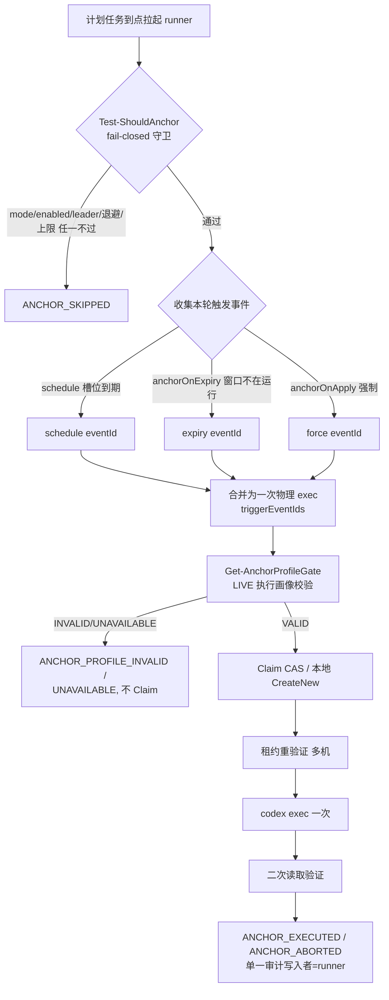

# AutoAnchor 触发模型重设计 — 开发设计说明书 v1.0

> 依据文档：[docs/review-2026-09-13.md](../review-2026-09-13.md)（项目审查：触发模型、架构、缺陷、安全与优化建议）。
> 本文把审查中的「建议」落成可实现的开发设计：目标架构、数据结构、算法、配置 schema、状态机、缺陷修复、测试与发布门禁。
> 审查基线：`codex/production-readiness` 分支 `cecc808`；文中行号以该提交为准。
> 工作项编号沿用仓库 CQK 序列（现有至 CQK-048），本设计新增自 CQK-049 起。

---

## 0. 文档信息

| 项 | 值 |
|---|---|
| 文档版本 | v1.0 |
| 状态 | 待评审（Draft） |
| 上游来源 | review-2026-09-13.md §1（触发模型）、§4（B1–B9）、§5（S1–S4）、§6（功能）、§7（建议顺序） |
| 影响范围 | `state-machine.ps1`、`runner.ps1`、`auto-anchor.ps1`、`install.ps1`、`common.ps1`、`app-server-client.ps1`、`config.example.jsonc`、测试与文档 |
| 明确不在本期 | 删除 Git 租约/退避/Claim 协调层（review §3.1，v1.0 之后再决策）；跨平台；通知/报表功能（列入后续阶段） |

---

## 1. 背景与目标

### 1.1 为什么重做

审查确认（代码事实，非假设）当前 AutoAnchor 触发模型有三个结构性问题：

1. **reset 触发不区分 5h/7d**（`state-machine.ps1:228-247`）：primary（5h）与 secondary（7d）一视同仁，都会触发锚定。但 5h 窗口在工作日内的空档只有午休级别，锚定收益极低；7d 窗口空档动辄一两天，收益才可观。
2. **keepalive 每 5 小时漂移触发、不看是否在用**（`state-machine.ps1:437-455`）：槽位按 `floor(epoch/5h)` 对齐，永远对不齐作息，且活跃使用中照打。
3. **schedule 与判断触发互斥**（`state-machine.ps1:374-376`）：配置任意 schedule 槽位即关闭 reset/idle/keepalive，导致「7d 到期补枪 + 上班时间对齐 5h」这一最合理组合做不到。

### 1.2 设计目标

| 目标 | 度量 |
|---|---|
| 两个触发器独立、可同开 | `schedule` 与 `anchorOnExpiry` 不再互斥 |
| 每次模型调用都有明确目的 | 日均模型调用从最多 6 次降到 1–2 次 |
| 到期用闹钟追而非轮询 | 7d 正常到期在 `resetsAt + 1 min` 补枪，与轮询周期无关 |
| 触发条件幂等，天然多机安全 | 只看「当前快照里窗口是否在运行」，不依赖上一轮怎么变 |
| 顺带消掉一批缺陷 | B1/B2/B3/B6/B9 随重构消失；B4/B5/B7/B8 单独修 |

### 1.3 非目标

- 不改变「零常驻、计划任务到点拉起、跑完即退」的运行形态。
- 不引入服务端或常驻进程。
- 不动 `auth.json`、不抓网页、不伪造客户端身份（安全边界不变）。
- 不删除多机协调层（见 §12 延期项）。

---

## 2. 关键前置验证（Phase 0，CQK-049）

> 这是所有后续工作的**门禁**。审查 §1.3 提出一个只能用真实数据回答的问题，它决定 reset 类触发是否有存在意义。

### 2.1 待验证假设

`WINDOW_RESET_OBSERVED` 只在 `cur.resetsAt > prev.resetsAt` 时产生（`state-machine.ps1:231-232`）。服务端在「窗口过期且空闲」时的行为只有三种可能：

| 服务端语义 | 过期空闲时 `resetsAt` | reset 触发的价值 |
|---|---|---|
| A. 第一条消息才开新窗口 | 不变 / 变空 | **零**：`resetsAt` 前进恰恰说明用户自己已开新窗口，再补一枪是浪费 |
| B. 到点自动滚动 | 自动前进 | **零**：窗口边界固定，锚定本身无意义 |
| C. 读取时给出「预计」的下一个 `resetsAt`，但窗口未真正开始 | 前进 | 有价值：是「窗口空闲可锚」的信号 |

仓库里所有测试和 soak 都是 mock；`docs/soak-runbook.md:174-180` 也说明 `normal` mock 下三种触发都打不着。

### 2.2 验证方法

1. 在 1–2 台真实主机、真实账号上，以 MonitorOnly 跑 N 天（建议 ≥ 7 天，覆盖至少一个完整 7d 窗口）。
2. 从真实 `history/` 与 `runtime/logs/*.jsonl` 中检索 `WINDOW_RESET_OBSERVED` 与 `resetsAt` 变迁，**对照当时 `usedPercent` 轨迹**：
   - 若 `resetsAt` 在 `usedPercent` 持续为 0（无人使用）时仍前进 → 语义 B 或 C；
   - 若 `resetsAt` 只在 `usedPercent` 由 0 变非 0（有人用）后才前进 → 语义 A。
3. 产出结论：A / B / C 哪一种。

### 2.3 对设计的影响（关键）

**新触发条件（§4）只看当前快照里窗口是否在运行，不依赖 prev→cur 的变迁**，因此对 A/B/C 三种语义都稳健（review §1.6）：

| 重置形态 | 快照特征 | 新条件判定 |
|---|---|---|
| 正常到期 | `resetsAt` ≤ now | 窗口不在运行 → 可锚 |
| 中途清空（统一重置） | `resetsAt` 变空 / 回到过去 / 窗口消失 | 窗口不在运行 → 可锚 |
| 窗口在运行 | `resetsAt` > now | 不锚 |

所以 **A/B/C 验证不阻塞 §4 的落地**——它只校准「anchorOnExpiry 是否值得为某窗口开启」以及 reset 类触发是否彻底删除。即便结论是 A 或 B，anchorOnExpiry 的「窗口不在运行才补」语义依然正确（A 下窗口不在运行正是该补的时刻；B 下窗口永远在运行，自然不补）。

---

## 3. 总体设计

### 3.1 两个独立开关

| 开关 | 管什么 | 触发条件 | 不设置时 |
|---|---|---|---|
| `codex.autoAnchor.schedule: ["08:55", ...]` | 5h 窗口对齐作息 | 到点拉起 runner；runner 重读额度，5h 窗口已在运行则跳过 | keeper 不碰 5h，靠用户自己使用开窗 |
| `codex.autoAnchor.anchorOnExpiry: ["secondary"]` | 7d 窗口不留空档 | **窗口不在运行**（`resetsAt` 为空或 ≤ now）且这次到期还没补过 → 打一枪 | keeper 不碰 7d |

设计要点：

- 两个开关**可同时启用**，去掉互斥（删除 `state-machine.ps1:374-376` 的 scheduleMode 排他分支）。
- 想恢复「24 小时连续锚 5h」，把 `"primary"` 也加进 `anchorOnExpiry`；配合 §5 的一次性闹钟，是严丝合缝的 5h 接 5h，不像 keepalive 那样每轮漂 0–59 分钟。
- 保留总闸 `codex.autoAnchor.enabled`（默认 false）：两个触发器配了但总闸没开也不调模型。调模型是有条款解释风险的那一步，值得多一道显式确认。
- **两个开关都不设 = 纯查询**：只读额度、写日志、（多机时）维护租约，永不执行 `codex exec`，等价于现在的 `mode: MonitorOnly`。
- **删除 keepalive**（被 `anchorOnExpiry: ["primary"]` 覆盖且更准）与 **idle 判定**（触发条件改成看当前快照后，不再需要「基线」）。

### 3.2 触发器全景（重设计后）



---

## 4. 触发模型详细设计（CQK-050 ~ CQK-053）

### 4.1 配置 Schema（v2 内演进，CQK-050）

`codex.autoAnchor` 节点变更：

| 字段 | 变更 | 说明 |
|---|---|---|
| `enabled` | 保留 | 总闸，默认 false |
| `prompt` / `maxPerDay` / `model` / `reasoningEffort` | 保留 | 不变 |
| `minimumGapMinutes` | 保留（降级为次级保险） | 任意两次锚定的全局最小间隔；schedule 显式槽位可绕过（用户显式请求），anchorOnExpiry 由去重键保证一次到期一次 |
| `anchorOnApply` | 保留 | 立即触发，任何模式可用 |
| `schedule` | 保留（语义变） | 从「与判断互斥的定时模式」变为「独立的 5h 对齐触发器」 |
| **`anchorOnExpiry`** | **新增** | 字符串数组，元素 ∈ {`"primary"`, `"secondary"`}；对列出的窗口类型做「到期补空档」 |
| `keepaliveIntervalMinutes` | **删除** | keepalive 触发器整体移除；配置迁移时忽略该键 |

`Get-AutoAnchorConfig`（`common.ps1:339`）返回表新增 `anchorOnExpiry = @(...)`（白名单过滤、去重、仅允许 `primary`/`secondary`），移除 `keepaliveIntervalMinutes`。旧配置含 `keepaliveIntervalMinutes` 时**静默忽略**（不报错），并在 `apply-config` 输出一条 deprecation 提示。

> `mode` 与 `enabled` 双开关的合并（review §3.4）列入后续清理，本期不动：`Test-AutoAnchorArmed`（`common.ps1:380`）仍以 `mode=AutoAnchor && enabled=true` 为唯一布防谓词，避免一次改动触碰过多面。

### 4.2 事件 ID 设计

保留现有确定性 eventId 约定（`state-machine.ps1:127-172`），新增 expiry 触发键：

```powershell
function Get-ExpiryAnchorEventId {
    # 一次到期只补一枪。键里编入「最后一次非空 resetsAt」，窗口重启后键改变，
    # 下一次到期自然是新触发；多机侧由确定性 eventId + CAS Claim 兜底 at-most-once。
    param([string]$BucketId, [string]$WindowType, [long]$LastNonEmptyResetsAt)
    return Get-Sha256Hex "expiry|$BucketId|$WindowType|$LastNonEmptyResetsAt"
}
```

- `Get-KeepaliveEventId`、`Get-IdleDetectionEventId` **删除**（随触发器删除）。
- `Get-ScheduleEventId`、`Get-ForceAnchorEventId` 保留。
- `Get-AnchorEventId`（reset 用）保留供事件日志，但 reset 事件不再驱动锚定（见 §4.4）。

### 4.3 守卫 `Test-ShouldAnchor` 改造（CQK-051/052/053）

位置：`state-machine.ps1:301-460`。前置 fail-closed 链（mode/enabled/leader/remote/stale/open-error/daily-cap）**原样保留**。仅替换「触发器选择」段（`:347-457`）：

```powershell
# 伪代码：替换 state-machine.ps1:347-457 的触发器选择块
$triggerKind = $null
$pending = @()

if ($Force) {
    # anchorOnApply：原逻辑保留（每日一次、每分钟槽位去重）
    # ...
    $triggerKind = 'force'
} else {
    # --- 触发器 1：schedule（5h 对齐，独立） ---
    foreach ($slot in $anchorCfg.schedule) {
        $slotTime = Parse-HHmm $slot; if (-not $slotTime) { continue }
        $dueAt = $Now.Date.Add($slotTime.TimeOfDay)
        if ($Now -lt $dueAt) { continue }                       # 未到点
        # B1 修复：迟到超过一个轮询周期 -> 标记 processed，不执行
        if (($Now - $dueAt).TotalMinutes -gt $pollIntervalMinutes) {
            Add-ProcessedEvent -State $State -EventId (Get-ScheduleEventId $today $slot)
            continue
        }
        $sid = Get-ScheduleEventId -Day $today -Slot $slot
        if ($State.processedEventIds -contains $sid) { continue }
        $pending += $sid
    }

    # --- 触发器 2：anchorOnExpiry（到期补空档，独立） ---
    $curMap = Get-BucketWindowMap @($State.buckets)
    foreach ($wt in $anchorCfg.anchorOnExpiry) {
        $win = $curMap.Values | Where-Object { $_.windowType -eq $wt } | Select-Object -First 1
        $running = ($win -and $win.resetsAt -and [long]$win.resetsAt -gt $nowEpoch)
        if ($running) { continue }                              # 窗口在运行 -> 不补
        $lastResetsAt = Get-LastNonEmptyResetsAt $State $wt     # 见 §6.2
        $eid = Get-ExpiryAnchorEventId -BucketId $win.bucketId -WindowType $wt -LastNonEmptyResetsAt $lastResetsAt
        if ($State.processedEventIds -contains $eid) { continue }
        $pending += $eid
    }

    if ($pending.Count -eq 0) { return & $deny 'no due schedule slot and no expired tracked window' }
    $triggerKind = 'auto'   # 或按来源细分 schedule/expiry，取第一个非空来源
}

return @{ should = $true; reason = $null; eventIds = $pending; triggerKind = $triggerKind }
```

要点：

- **去互斥**：schedule 与 anchorOnExpiry 的 eventId 都进 `$pending`，由 `Invoke-AutoAnchorIfNeeded` 合并为一次物理 exec（沿用 CQK-036 的 `triggerEventIds` 合并语义，`auto-anchor.ps1:93-114`）。
- **B1 修复**：schedule 槽位加「迟到 > 轮询周期则标记 processed 不执行」。需要把 `poll.intervalMinutes` 传入守卫（经 `$Config`）。
- **B2/B3/B6/B9 随重构消失**：reset 不再驱动锚定（B2）、keepalive 删除（B3）、pending-reset+静默期逻辑删除（B6）、idle 判定删除（B9）。
- **B4 修复**：删除 `$readFailed` 死代码（`state-machine.ps1:347-350` 的重复扫描与 `:371`、`:425` 两个不可达分支）。READ_FAILED 在 `:330` 已 fail-closed 返回，无需二次判断。

### 4.4 reset 事件的去留

- `Get-StateEvents`（`state-machine.ps1:174-289`）**仍产生** `WINDOW_RESET_OBSERVED` 事件用于 history/审计与 status 展示（「下一次预计重置」）。
- 但 `runner.ps1:207-214` 的 `pendingAnchorEvents` 收集与 `Test-ShouldAnchor` 的 reset 分支**删除**——reset 事件不再进入锚定决策。
- 这同时实现 review §1.6 的「统一重置覆盖」：新条件只看当前快照，正常到期/中途清空/窗口消失一个判断全覆盖。

---

## 5. 闹钟（精确触发）设计（CQK-054/055）

### 5.1 原则

> **计划任务只负责「到点把 runner 叫起来」，不负责「要不要打」。** 闹钟不携带决策；过期或多余的闹钟只多花一次只读查询，不多花一次模型调用。

到期分两类：

- **可预知的到期**（7d 正常走完）：`resetsAt` 提前 7 天就知道 → 注册一次性闹钟。
- **不可预知的重置**（服务端统一重置）：没有预告，只能靠轮询发现，延迟 = 轮询周期。想更快就把 `poll.intervalMinutes` 调到 15–30（`account/rateLimits/read` 只读、不耗额度）。

### 5.2 闹钟任务

- 任务名：派生自主任务，`<task.name>.AnchorAlarm`（可用 `task.alarmName` 覆盖）。
- 触发器：单个 `-Once -At <target>`，**无重复间隔**。
- 动作：复用 `Get-KeeperHiddenLauncherSpec`（`install.ps1:57-83`）的 wscript 隐藏启动，指向同一 `runner.ps1`，附加 `-FromAlarm -WaitLockSeconds 60`。
- 设置：继承 `task.wakeToRun` / `runIfNetworkAvailable`；`StartWhenAvailable=true`。

### 5.3 闹钟维护规则（每次成功轮询末尾执行）

仅当 `anchorOnExpiry` 非空且已布防时维护：

```powershell
function Sync-AnchorAlarmTask {
    param($Config, $State, $Now)
    $targets = @()
    $curMap = Get-BucketWindowMap @($State.buckets)
    foreach ($wt in $anchorCfg.anchorOnExpiry) {
        $win = $curMap.Values | Where-Object { $_.windowType -eq $wt } | Select-Object -First 1
        if ($win -and $win.resetsAt -and [long]$win.resetsAt -gt (ConvertTo-EpochSeconds $Now)) {
            $targets += [long]$win.resetsAt
        }
    }
    if ($targets.Count -eq 0) { Remove-AnchorAlarmTask -IfExists; return }   # 无未来到期 -> 删闹钟
    $target = (($targets | Measure-Object -Minimum).Minimum) + 60            # 最早 resetsAt + 1 min
    Set-AnchorAlarmTask -At $target                                          # 同名任务改触发时间，不新建
}
```

- **同一个任务名，改触发时间，不新建**：`Set-ScheduledTask -Trigger (New-ScheduledTaskTrigger -Once -At $target)`。
- 没有窗口在跟踪 → 删除闹钟任务。
- 统一重置示例（review §1.5）：周三 14:00 窗口被清空 → 15:00 轮询发现窗口不在运行 → 立即补一枪（anchorOnExpiry 当前触发），新 `resetsAt` = 下周三 15:0x，闹钟改指到下周三 15:01；原周六 03:01 的闹钟已被改走，什么都不发生。即使改失败、旧闹钟真的跑了：runner 读一次额度看到窗口在运行，记 `ANCHOR_SKIPPED` 退出。

### 5.4 锁等待（CQK-055，含 B7）

- 问题：一次性闹钟可能与整点轮询撞车；现有本地锁抢不到就 `RUNNER_SKIPPED` 退出（`runner.ps1:61-67`），会让补枪推迟到下一轮。B7 同理：`install.ps1:177-190` 的 forced runner 与「安装时刻 +1 分钟」的首次计划轮询争锁，输了被静默丢弃。
- 设计：`runner.ps1` 新增参数 `-WaitLockSeconds <int>`（默认 0，保持计划轮询的 `IgnoreNew` 语义）。闹钟与 forced 启动传 `-WaitLockSeconds 60`：`Enter-RunnerLock` 失败时在 60 秒内轮询重试，超时再放弃。
- `Enter-RunnerLock`（`common.ps1`）需支持带超时的获取。

### 5.5 wakeToRun 与收益边界（review §1.7）

| `task.wakeToRun` | 到期时刻电脑睡眠 | 结果 |
|---|---|---|
| false（默认） | 任务不跑，下次醒着时 `StartWhenAvailable` 补跑 | 周一开机才补枪，那时用户本就要用，**补枪等于没补** |
| true | 从睡眠/休眠唤醒跑 runner，按电源策略再睡回 | 准时开窗，下次重置提前到 7 天后同一时刻 |

限制：只能从睡眠/休眠唤醒，**关机唤不醒**；笔记本合盖被唤醒会发热，建议笔记本保持 false、桌面机开 true。文档（README + operations）需写明此边界。

---

## 6. 数据结构与状态变更

### 6.1 `runtime/state.json`（schema 2 → 3）

新增/变更字段：

| 字段 | 变更 | 说明 |
|---|---|---|
| `anchors` | 保留 | `attemptCount/successCount/failedCount/lastAttemptAt/lastSuccessAt/anchorOnApplyAttempted` 不变 |
| `processedEventIds` | 保留 | 本地去重，cap 200（`Add-ProcessedEvent`，`state-machine.ps1:94-102`）足够装 per-expiry 键 |
| `expiryTrack` | **新增** | map：`"<bucketId>|<windowType>" -> lastNonEmptyResetsAt (long)`，供 §4.3 的 `Get-LastNonEmptyResetsAt` 与闹钟计算 |
| `pendingAnchorEvents` | **删除** | reset 不再驱动锚定，无需 pending 队列（B6 随之消失） |

### 6.2 `Get-LastNonEmptyResetsAt`

```powershell
function Get-LastNonEmptyResetsAt {
    # 返回该窗口「最后一次非空 resetsAt」。优先取 expiryTrack 记录；若无记录且当前
    # 快照有 resetsAt（即便已过期）则用当前值；都没有则返回 0（视为从未跟踪，
    # 此时 eventId 退化为 hash(expiry|bucket|window|0)，首次到期仍可触发一次）。
    param($State, [string]$WindowType)
    # ...
}
```

每轮成功读取后，把当前快照里每个被跟踪窗口的非空 `resetsAt` 写入 `expiryTrack`。

### 6.3 迁移

- `Load-KeeperState`（`state-machine.ps1:76-86`）：schema 2 → 3 时，初始化空 `expiryTrack`，丢弃 `pendingAnchorEvents`；`anchors` 沿用 `Get-AnchorStatistics` 的保守迁移（`common.ps1:317-337`，旧 `count` 只迁移为 attempts，不伪造成功）。
- 配置：`config.json` 含 `keepaliveIntervalMinutes` 时忽略并提示；`schedule` 语义自动切换（不再互斥），无需用户改键。

---

## 7. 缺陷修复设计（B1–B9）

| # | 位置 | 根因 | 修复 | 工作项 |
|---|---|---|---|---|
| B1 | `state-machine.ps1:359-369` | 定时槽位无迟到上限 | §4.3 加「迟到 > poll 周期则标记 processed 不执行」 | CQK-052 |
| B2 | `state-machine.ps1:228-247` | reset 不分 primary/secondary | reset 不再驱动锚定（§4.4） | CQK-053 |
| B3 | `state-machine.ps1:437-455` | keepalive 不看 usedPercent | keepalive 删除 | CQK-053 |
| B4 | `state-machine.ps1:347-350,371,425` | `$readFailed` 死代码（`:330` 已 return） | 删除死分支 | CQK-053 |
| B5 | `runner.ps1:179-181` | 本地网络错误写全集群退避 | 全局退避仅对 429/auth；NETWORK_ERROR/TIMEOUT/EOF 只写本地退避 | CQK-056 |
| B6 | `runner.ps1:207-214` + `state-machine.ps1:376-384` | pending reset + 静默期 = 迟到锚定 | pending 队列删除 | CQK-053 |
| B7 | `install.ps1:177-190` | forced runner 争锁失败静默丢弃 | §5.4 锁等待 60s | CQK-055 |
| B8 | `app-server-client.ps1:48` | `dns/tls` 无词边界 | 加词边界 `\b` | CQK-057 |
| B9 | `state-machine.ps1:418-436` + `runner.ps1:227` | idle 用 `lastReadAt` 判「第二次观测」，但读失败也写它 | idle 判定删除，问题消失 | CQK-053 |

**B5 详述**（CQK-056）：`runner.ps1:179-181` 当前对 `NETWORK_ERROR/TIMEOUT/EOF` 同时 `Set-Backoff`（本地）与 `Set-GlobalBackoff`（集群）。本地断网不是服务端信号，不该让别的机器停；且 pending marker 在网络恢复后才送达，那时已无意义。修复后：

```powershell
} elseif ($read.errorKind -in @('NETWORK_ERROR', 'TIMEOUT', 'EOF')) {
    Set-Backoff -Root $KeeperRoot -Minutes 10 -Reason 'network'   # 仅本地
    # 不再写 Set-GlobalBackoff
} elseif ($read.errorKind -eq 'RATE_LIMITED') {
    Set-Backoff -Root $KeeperRoot -Minutes 60 -Reason '429'
    $null = Set-GlobalBackoff -Config $cfg -KeeperRoot $KeeperRoot -Minutes 60 -Reason '429' -Machine $machine   # 429 仍集群级
}
```

**B8 详述**（CQK-057）：`app-server-client.ps1:48` 的 `NETWORK_ERROR` 正则中 `dns|tls` 无词边界，含这三个字母的任意消息（如路径里的 `dns`）会被误判为可重试的网络错误。给 `dns` 和 `tls` 加上词边界 `\b`，并补一条「含 `dns` 子串但非独立词」的回归用例。

---

## 8. 安全设计（S1–S4）

| # | 问题 | 设计 | 工作项 |
|---|---|---|---|
| S1 | 部署目录非用户私有（如 `D:/Tools`）时 `runtime/hidden-launch.vbs` 与 `scripts` 对同机其他用户可写 → 当前会话内任意代码执行 | install 时检查部署目录 ACL；若非用户私有则告警并建议 `%LOCALAPPDATA%`；README 快速开始改荐 `%LOCALAPPDATA%` | CQK-058 |
| S2 | `Hide-SensitiveText` 是关键字启发式，错误文本里的完整路径（含 Windows 用户名）不脱敏 | 白名单投影基础上，把路径归一化（用户名 → `<user>`）；AUTH_ERROR 进 history 前过同一投影 | CQK-059 |
| S3 | prompt 禁 `%$"` 等元字符是因 `.cmd` 走 cmd.exe | 根本解法：npm 安装时直接调 `node <codex.js>` 而非 `codex.cmd`，去掉元字符限制、Unicode prompt 更安全（列入后续，非本期阻断） | 后续 |
| S4 | `status.cmd -Live` 在 PASSIVE 机器上也直接查询额度，与「任意时刻只有 Leader 查询」不一致 | 文档说明「手动操作可接受」；或 `-Live` 在非 Leader 时提示需确认（本期仅文档） | CQK-060 |

---

## 9. 状态机与事件

### 9.1 事件清单（变更后）

| 事件 | 产生处 | 变更 |
|---|---|---|
| `QUOTA_SNAPSHOT_CHANGED` / `WINDOW_RESET_OBSERVED` / `WINDOW_DISAPPEARED` / `LIMIT_REACHED` / `AUTH_ERROR` / `SCHEMA_UNKNOWN` / `LEADER_CHANGED` | `Get-StateEvents` | 保留（审计/status 用） |
| `ANCHOR_SKIPPED` / `ANCHOR_EXECUTED` / `ANCHOR_ABORTED` / `ANCHOR_PROFILE_INVALID` / `ANCHOR_PROFILE_UNAVAILABLE` / `ANCHOR_LOCAL` | `auto-anchor.ps1` | 保留 |
| `ANCHOR_ALARM_SET` / `ANCHOR_ALARM_CLEARED` | 新增（闹钟维护） | 记录闹钟指向/删除，便于审计与排查 |

### 9.2 角色状态机

`DISABLED/PASSIVE/LEADER/DEGRADED/AUTH_ERR/BACKOFF` 不变。AutoAnchor 子状态由「判断模式/定时模式互斥」改为「多触发器并行收集 → 合并 exec」：

```text
armed(=mode AutoAnchor && enabled)
  -> 收集触发: schedule(due) ∪ anchorOnExpiry(窗口不在运行) ∪ force(anchorOnApply)
  -> 合并 triggerEventIds
  -> Profile Gate(LIVE) -> Claim(CAS/本地) -> LeaseRevalidate(多机) -> codex exec -> Verify
  -> COMPLETED / FAILED / EXPIRED
```

---

## 10. 测试设计（CQK-061）

### 10.1 单元测试（mock app-server，无需真实凭证）

| 用例 | 断言 |
|---|---|
| schedule 与 anchorOnExpiry 同开 | 两者 eventId 都进 pending，合并为一次 exec，`triggerEventIds` 含两者 |
| B1：迟到槽位 | 安装时刻晚于槽位 + 超过 poll 周期 → 标记 processed、不 exec |
| anchorOnExpiry：窗口在运行 | `resetsAt > now` → 不触发 |
| anchorOnExpiry：窗口不在运行 | `resetsAt ≤ now` 或为空 → 触发一次；同 `lastNonEmptyResetsAt` 不重复触发 |
| anchorOnExpiry：窗口重启后 | 新 `resetsAt` → 新 eventId，可再次触发 |
| 统一重置（中途清空） | `resetsAt` 变空 → 触发（review §1.6 表） |
| keepalive/idle 删除 | 配置 `keepaliveIntervalMinutes` 被忽略；无 idle 触发路径 |
| B4：`$readFailed` | READ_FAILED 在守卫前置链 fail-closed，无死代码 |
| B5：本地网络错误 | 只写本地退避，不写 `coordination/backoff.json` |
| B8：词边界 | 消息含 `subtls`/路径含 `dns` 子串 → 不判 NETWORK_ERROR |
| 闹钟维护 | 有未来到期 → 任务指向最早 `resetsAt+1min`；无 → 删除；统一重置后改指 |
| 锁等待 | `-WaitLockSeconds 60` 下争锁等待后获取；超时放弃 |

### 10.2 集成测试（临时本地 bare 仓库）

沿用现有 7 套 Git 集成测试模式（anchor-claim、auto-anchor、concurrency、github-sync、global-backoff、leader-lease、runner），新增/更新：

- 多机 anchorOnExpiry：A 机补枪后，B 机下一轮读到窗口已运行 → 不再打（幂等性免费获得多机安全）。
- 多机同到期撞车：确定性 eventId + CAS Claim，全局最多一次副作用。
- 闹钟与整点轮询并发：锁等待不丢补枪。

### 10.3 双运行时矩阵

PS 7 与 Windows PowerShell 5.1 全量；PSScriptAnalyzer 0 Error；秘钥扫描；候选 ZIP 双构建同 SHA-256（沿用 CQK-047/048 门禁）。

---

## 11. 发布门禁与验收标准

1. Phase 0（CQK-049）产出 A/B/C 结论，并据此确认 anchorOnExpiry 的默认建议窗口。
2. 双运行时全量测试通过；新增用例全绿。
3. 双机 soak + 故障注入（沿用 `docs/soak-runbook.md`），重点记录：触发唯一性、闹钟准点性、锁等待行为、`wakeToRun` 下的唤醒表现。
4. 真实 CLI 的 `config/read`、`model/list` 分页与一次受控 exec 冒烟（需部署账号环境与明确调用范围）。
5. 未完成上述证据，不创建版本 tag、不发布 Release、不声称生产验收完成。

---

## 12. 审查全部建议的处置一览（含延期项）

下表覆盖审查里**所有**优化/改进建议的处置，确保无遗漏：「本期」= 已纳入 §4–§10 设计与 §13 工作项；「独立」= 不依赖触发模型重构、可随时单独做；「延期」= 列入后续阶段。

| 审查出处 | 建议 | 处置 | 工作项 |
|---|---|---|---|
| §1.4 | 触发模型两开关重构（schedule + anchorOnExpiry、去互斥、删 keepalive/idle） | 本期 | CQK-050~053 |
| §1.5 | 闹钟精确触发（一次性任务追 `resetsAt+1min`） | 本期 | CQK-054/055 |
| §1.7 | wakeToRun 收益边界（笔记本 false / 桌面机 true） | 本期（文档） | CQK-062 |
| §2 | 产品定位二选一：承认是「额度窗口调度器」（监控为配套），或把监控做出出口（toast/周报/重置提醒） | 战略决策，与 §6.2/6.3 出口一并定 | 见下方「产品定位」 |
| §2 | Windows-only 在 README 第一行声明（Codex 用户大头在 macOS/Linux） | 独立（文档） | CQK-064 |
| §3.1 | 删除 Git 租约/退避/Claim 协调层（服务端状态即协调器，约 1,400 行保护价值近零的 at-most-once） | 延期（v1.0 后决策） | — |
| §3.2 | **续租冗余**：配置校验已强制 `TTL ≥ 2×poll`，poll 后的续租（`runner.ps1:305`）冗余，省略可省一半 Git 流量 | 独立优化 | CQK-063 |
| §3.3 | 本地网络错误写全集群退避 | 本期（=B5） | CQK-056 |
| §3.4 | mode/enabled 双开关合并为单闸 | 延期 | — |
| §3.5 | 配置 preset（`single-pc` / `single-pc+weekly-anchor` / `multi-pc`） | 延期 | — |
| §4 B1–B9 | 缺陷修复 | 本期 | 见 §7 |
| §5 S1–S4 | 安全加固 | 本期 S1/S2/S4；S3 延期 | CQK-058/059/060 |
| §6.1 | 精确调度 | 本期（=§5） | CQK-054 |
| §6.2 | 通知：runner 加 Windows toast（7d 用量超阈值 / 锚定执行 / AUTH_ERROR），零常驻可做 | 延期 | — |
| §6.3 | 报表：从 history JSONL 生成一页本地 HTML（用量曲线、重置时间、锚定记录） | 延期 | — |
| §6.4 | status 增加「下一次预计重置」「下一次计划锚定」两行 | 延期 | — |
| §6.5 | `schedule` 支持星期（`"Mon 08:55"`） | 延期 | — |
| §6.6 | **仓库整理**：根目录 `findings.md`/`progress.md`/`task_plan.md` 与 `docs/` 同名文件重复、公开仓库首页不该有；README 255 行太长，拆出 20 行 quick start | 独立（仓库卫生） | CQK-064 |

### 12.1 产品定位（review §2，战略项）

审查指出：真正的卖点是 AutoAnchor，却被标成「实验、默认关、有风控风险」；MonitorOnly 的产出只有 JSONL + `status.cmd` 文本，没有消费者（无图、无通知、无阈值告警），而 Codex CLI 自带 `/status`，「每小时记一次额度」对个人用户价值很薄。需二选一：

- **路线 A**：承认本工具是**额度窗口调度器**，监控是配套——则本设计（触发模型 + 闹钟）正是核心，监控出口从简。
- **路线 B**：把监控做出**出口**（7d 用量超阈值 toast、周报页、重置时间提醒，即 §6.2/6.3/6.4）——则通知/报表从延期项提升为正式工作项。

该定位决策影响 §6.2~6.4 的优先级，建议在触发模型重构落地后、v1.0 前确定。无论选哪条，**Windows-only 都应在 README 第一行声明**（已列入 CQK-064）。

---

## 13. 实施顺序与工作项

| 序 | 工作项 | 内容 | 依赖 |
|---|---|---|---|
| 0 | CQK-049 | Phase 0：真实数据验证 A/B/C（插桩 + runbook + 结论） | 无（门禁） |
| 1 | CQK-050 | 配置 schema：新增 `anchorOnExpiry`、删 `keepaliveIntervalMinutes`、迁移 | 无 |
| 2 | CQK-051 | anchorOnExpiry 触发器 + `Get-ExpiryAnchorEventId` + `expiryTrack` | CQK-050 |
| 3 | CQK-052 | schedule 独立化 + B1 迟到上限 | CQK-050 |
| 4 | CQK-053 | 删 keepalive/idle/pending-reset + B4 死代码（B2/B3/B6/B9 随之消失） | CQK-051/052 |
| 5 | CQK-054 | 一次性闹钟任务管理（注册/改指/删除） | CQK-051 |
| 6 | CQK-055 | runner `-WaitLockSeconds` + B7 forced 锁等待 | CQK-054 |
| 7 | CQK-056 | B5：本地网络错误不写全集群退避 | 无 |
| 8 | CQK-057 | B8：`dns/tls` 加词边界 + 回归 | 无 |
| 9 | CQK-058/059/060 | S1 ACL 检查 / S2 路径归一化 / S4 文档 | 无 |
| 10 | CQK-061 | 测试矩阵 + 双运行时 + 集成测试 | 以上 |
| 11 | CQK-062 | 文档：README/config/scenarios/operations/architecture 同步 | 以上 |
| — | CQK-063 | 续租冗余优化：`TTL ≥ 2×poll` 时省略 poll 后续租（`runner.ps1:305`），省一半 Git 流量（review §3.2） | 独立，可随时做 |
| — | CQK-064 | 仓库整理：根目录 `findings.md`/`progress.md`/`task_plan.md` 与 `docs/` 去重、README 拆 20 行 quick start、Windows-only 首行声明（review §6.6/§2） | 独立，可随时做 |

> 注：CQK-049 是门禁但不阻塞 CQK-050~053 的设计与并行开发（§2.3）；它阻塞的是「anchorOnExpiry 默认建议」与「reset 触发彻底删除」的最终定稿。

---

## 14. 风险与未决问题

| 风险/未决 | 影响 | 缓解 |
|---|---|---|
| A/B/C 结论为 A 或 B | reset 类触发无存在意义 | 新条件不依赖 reset 变迁，anchorOnExpiry 语义仍正确（§2.3） |
| 闹钟任务被系统/杀软清理 | 到期补枪延迟到下一轮轮询 | 每轮轮询重建/校正闹钟；轮询本身是兜底 |
| `wakeToRun` 唤醒笔记本发热 | 用户体验 | 文档明确建议笔记本 false、桌面机 true |
| 多机秒级撞车 | 多一条最小 prompt | 60 分钟轮询下概率可忽略；确定性 eventId + CAS Claim 兜底 |
| 删除 keepalive/idle 的行为回归 | 旧用户依赖 | CHANGELOG 明确迁移说明；`anchorOnExpiry:["primary"]` 提供等价能力 |

---

*本说明书为开发设计稿，落地前需评审；行号与函数名以审查基线 `cecc808` 为准，实施时以当前 main 重新核对。*
