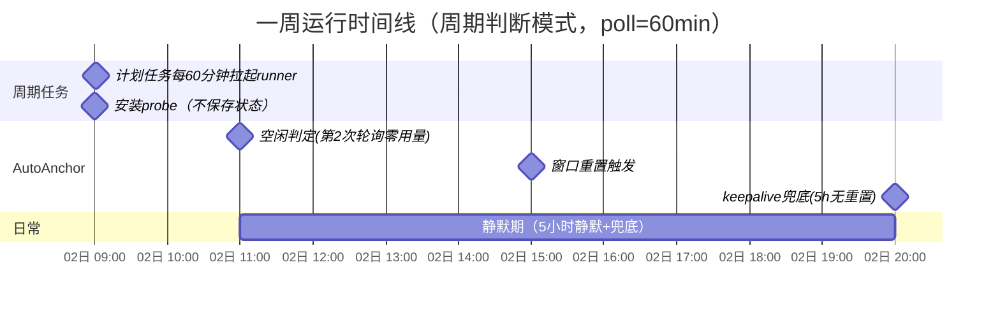
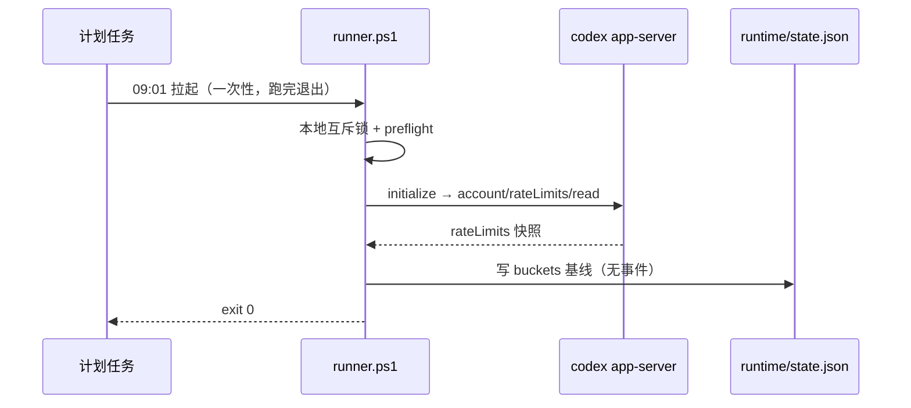
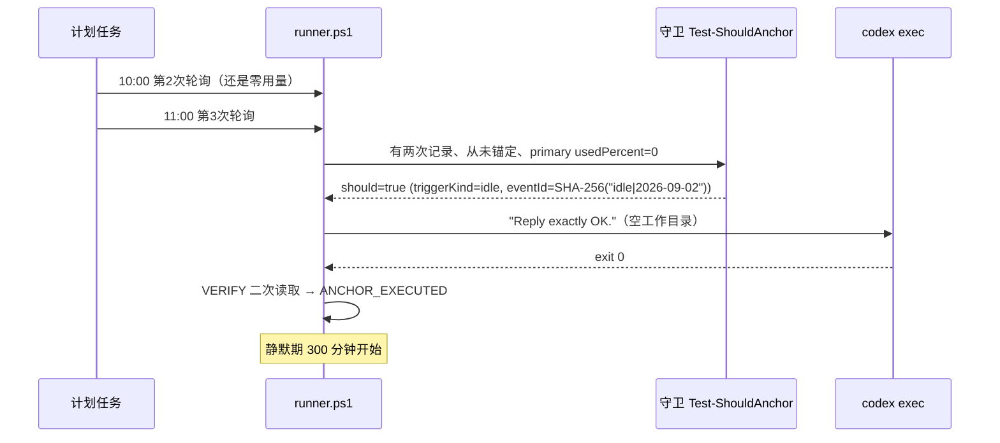
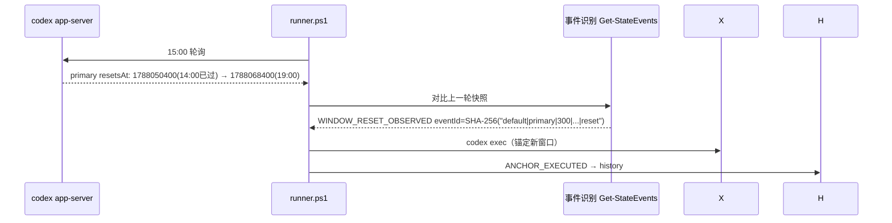
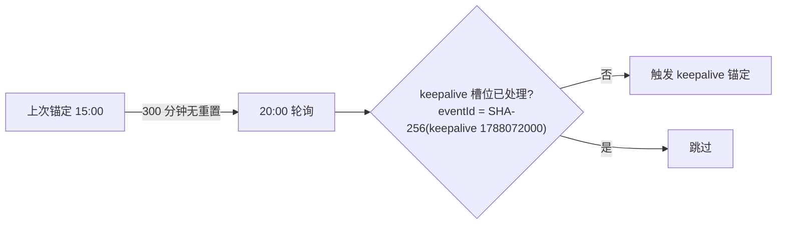
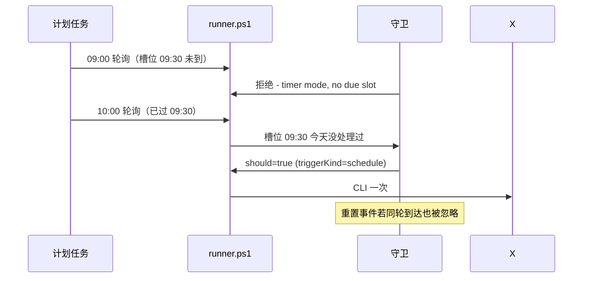
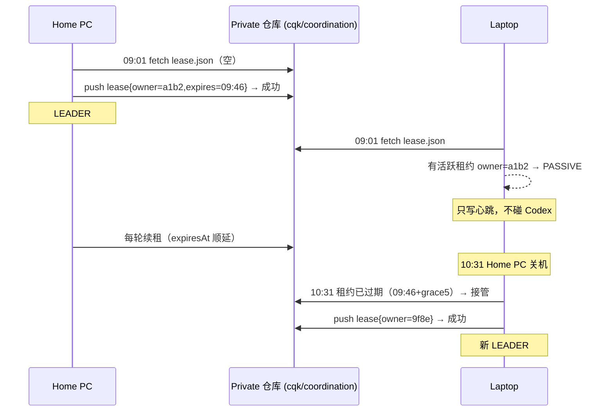
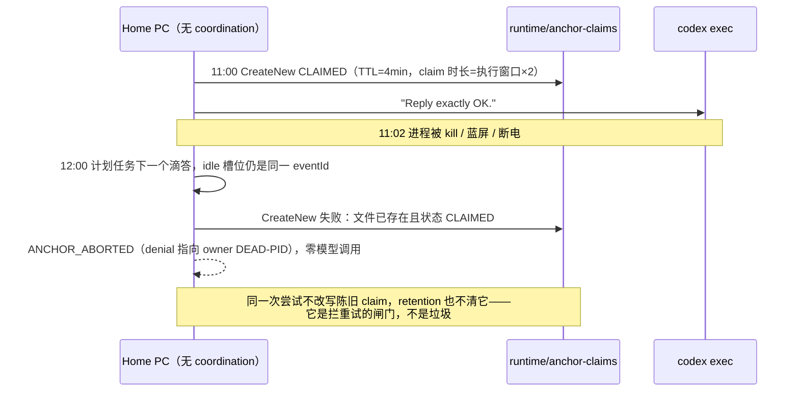
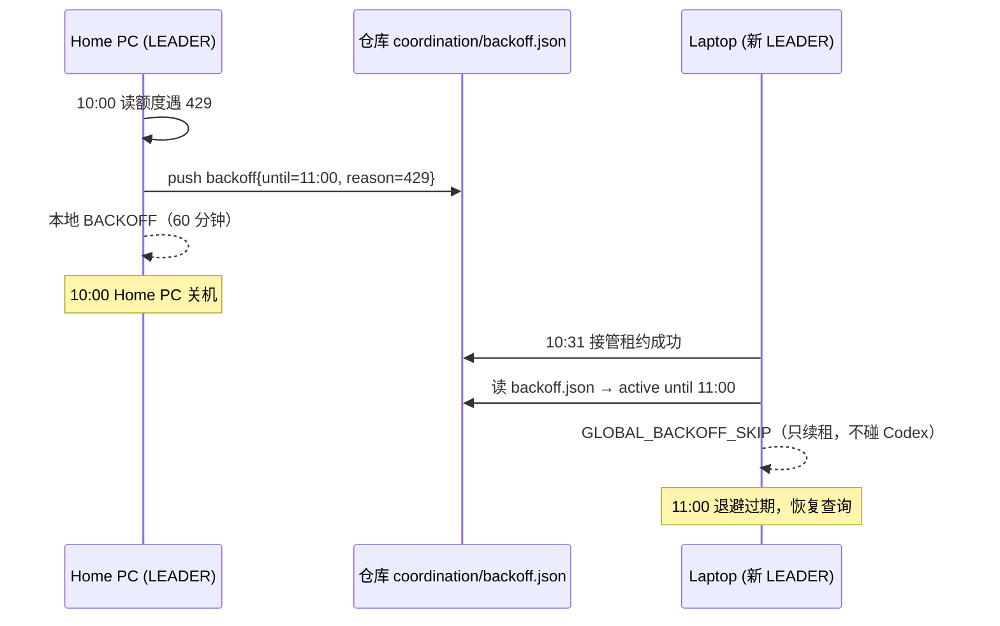
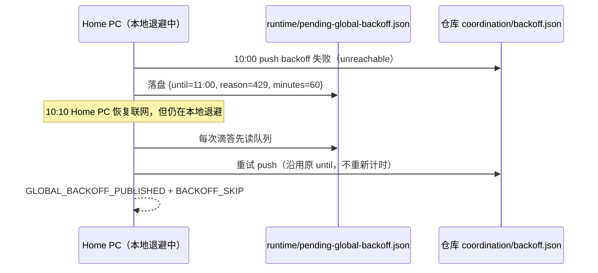

# 场景详解（真实模拟数据）

> 本页把 README 里提到的每种仓库处理场景展开：用真实格式的时间、字段和文件内容模拟
> 一台机器（machineId `a1b2c3d4e5f6…`，标签 Home PC）从安装到运行一周的完整时间线。
> 所有 JSON 均为实际会写入 runtime/ 或推送到日志仓库的真实格式（字段与代码一一对应）。

---

## 0. 时间线总览



## 1. 安装与首次轮询（first observation）

双击 `install.cmd`：只读 probe 通过后注册计划任务，锚点 = 安装时刻+1 分钟。
首次正式轮询是 first observation——只写基线快照，不产生事件、不触发锚定。



**模拟数据 —— 第一次轮询后 `runtime/state.json`（节选）：**

```json
{
  "schema": 2,
  "role": "LEADER",
  "lastReadAt": "2026-09-02T09:01:03+08:00",
  "buckets": [
    {
      "bucketId": "default",
      "windows": [
        { "windowType": "primary",   "usable": true, "windowDurationMins": 300,   "usedPercent": 0, "resetsAt": 1788050400 },
        { "windowType": "secondary", "usable": true, "windowDurationMins": 10080, "usedPercent": 0, "resetsAt": 1788655200 }
      ]
    }
  ],
  "anchors": { "day": null, "count": 0, "lastAnchorAt": null }
}
```

对应 `status.cmd` 输出（节选）：

```text
Task installed      : YES
Last task run       : 2026-09-02 09:01:03  (Success)
Polling interval    : 60 min
This machine role   : LEADER
Last quota read     : 2026-09-02T09:01:03+08:00
 5h window          : 0% used, reset 2026-09-02 14:00
 7d window          : 0% used, reset 2026-09-09 14:00
Last error          : none
```

## 2. 周期判断模式（schedule 为空，默认）

由 keeper 判断时机，三个触发器按优先级：重置 > 空闲判定 > 空闲兜底。

### 2.1 空闲判定触发（场景 1：从来没启动过 Codex）

前提：从未锚定（`anchors.count=0`）+ 第一次观测只是基线。



| 时间 | 轮询看到 | 守卫判定 | 动作 |
|------|---------|---------|------|
| 09:01 | 0% 用量，重置 14:00 | 第一次观测，只有基线 | 只记录 |
| 10:00 | 0% 用量，重置 14:00 | 从未锚定，但上次记录是 09:01 基线（本次记录还只是第二次观测） | 只记录 |
| 11:00 | 0% 用量，重置 14:00 | 从未锚定 + 第二次观测成立 + 零用量 → **触发** | **CLI 一次** |
| 11:00~16:00 | 用量 0%（CLI 消耗极小） | 静默期内 | 不触发 |
| 16:00 | 重置时间 14:00→19:00（窗口滚动了） | 重置事件优先级最高 | **CLI 一次**（triggerKind=reset） |

### 2.2 窗口重置触发（用完 5 小时额度）

判定条件：`旧 resetsAt 已过期 && 新 resetsAt > 旧 resetsAt`。



**模拟数据 —— 每次轮询的快照对比：**

| 轮询时刻 | 5h 窗口 | 7d 窗口 | 事件 |
|---------|---------|---------|------|
| 14:00 | 100% 已用，resetsAt=1788050400（=14:00，未过） | 不变 | 无（"等于"不算过期） |
| 15:00 | 3% 已用，resetsAt=1788068400（19:00） | 不变 | `WINDOW_RESET_OBSERVED` → 锚定 |
| 19:00 | 100% 已用，resetsAt=1788068400（=19:00，未过） | 不变 | 无 |
| 20:00 | 5% 已用，resetsAt=1788086400（24:00） | 不变 | `WINDOW_RESET_OBSERVED` → 锚定 |

### 2.3 空闲兜底触发（keepalive）

前提：已有过至少一次锚定；距上次锚定 ≥ `keepaliveIntervalMinutes`（默认 300）且期间没观测到任何重置。



**模拟数据：**

| 轮询 | 判定 |
|------|------|
| 16:00~19:00 | 无重置事件；距 15:00 锚定 < 300 分钟 → 静默 |
| 20:00 | 距 15:00 锚定恰好 300 分钟 → **触发 keepalive 锚定** |
| 20:00+ | 下一兜底槽位 = 24:00 之后（5h 边界） |

## 3. 每日定时模式（schedule 非空，与判断互斥）

配置 `codex.autoAnchor.schedule=["09:30","21:00"]` 后，**判断触发器全部停用**：
重置/空闲/兜底不再触发，只有时间点驱动。



**模拟数据 —— 一天两槽位：**

| 轮询时刻 | 槽位状态 | 动作 |
|---------|---------|------|
| 09:00 | 09:30 未到 | 拒绝（timer mode; no due slot） |
| 10:00 | 09:30 已过，未处理 | **触发** eventId=SHA-256(`schedule|2026-09-02|09:30`) |
| 11:00~20:00 | 09:30 已处理；21:00 未到 | 拒绝 |
| 22:00 | 21:00 已过，未处理 | **触发** |
| 次日 10:00 | 新一天 09:30 未处理 | **再触发**（每天最多一次/槽位） |

## 4. 立即触发（anchorOnApply，任何模式可用）

`anchorOnApply=true` 时，每次 `install.cmd` / `apply-config.cmd` 后 runner 立即带
`-ForceAnchor` 参数运行一次：绕过静默期与模式判断，仍受每日上限约束。

```text
09:30  apply-config.cmd → runner -ForceAnchor
       → guard: force 触发（eventId=SHA-256(force|<当前分钟>)）
       → codex exec → ANCHOR_EXECUTED
09:31  又点了一次 apply-config.cmd
       → guard: forced anchor already executed this minute → 拒绝
10:00  再点 apply-config.cmd（新分钟槽位）
       → 再触发一次（每日上限 6 次内）
```

## 5. 多机互斥（Leader 租约）

两台机器（Home PC `a1b2…`、Laptop `9f8e…`）共用一个 Private 日志仓库。
租约文件 `coordination/lease.json` 在 `cqk/coordination` 分支，Git push 冲突 = CAS。



**模拟数据 —— `coordination/lease.json`：**

```json
{
  "schema": 1,
  "ownerId": "a1b2c3d4e5f64789a0b1c2d3e4f5a6b7",
  "ownerLabel": null,
  "acquiredAt": "2026-09-02T09:01:01+08:00",
  "expiresAt": "2026-09-02T09:46:01+08:00"
}
```

（`ownerLabel` 默认不写：`logging.includeMachineLabel=false`，隐私默认关闭。）

### 5.1 锚定的至多一次保证（统一 Claim，CQK-023）

§2.1 / §2.3 的每个 `CLI 一次` 前面都有一步**先落盘的 CLAIMED**：无论单机还是有
Private 仓库，都在 `codex exec` **之前**原子写入同一种记录，无论后面是崩在 exec
里还是 COMPLETED 没推出去，这个 eventId 都不会被重试。

| | 存储位置 | 原子手段 | 被拒原因文本 |
|---|---|---|---|
| 多机（`github.coordination.enabled`） | `coordination/events/<eventId>.json` | Git CAS push（`ParentCommit`） | `claim push rejected (…); another machine claimed first` |
| 单机（LOCAL_ONLY） | `runtime/anchor-claims/<eventId>.json` | `FileMode.CreateNew` | `event already CLAIMED (by …); no retry` |

两个 backing 的记录形状、字段顺序、状态机完全一致
（`schema/eventId/state/ownerId/claimedAt/claimExpiresAt/completedAt/result`），只是命名空间
不同；同一台机器由选举结果只会落在其中一个上。



**模拟数据 —— 崩溃前写下的 `runtime/anchor-claims/d75480fc…7039.json`**
（`eventId = SHA-256("idle|2026-09-02")`，与 §2.1 同一条触发）：

```json
{
  "schema": 1,
  "eventId": "d75480fc55c8c255ad2e0f7e0ab75f3bf43581e888094376df21415eb8537039",
  "state": "CLAIMED",
  "ownerId": "a1b2c3d4e5f64789a0b1c2d3e4f5a6b7",
  "claimedAt": "2026-09-02T11:00:04+08:00",
  "claimExpiresAt": "2026-09-02T11:04:04+08:00",
  "completedAt": null,
  "result": null
}
```

成功路径把它改写成 `COMPLETED`，`completedAt` 落时刻、`result` 保持 JSON `null`
（一次干净的锚定没有失败原因——空字符串会被当成假原因）。exec 失败但确实调用了模型
的写成 `FAILED` 并带 `result`。

`claimExpiresAt` 是 TTL 提示（`max(2, ceil(queryTimeoutSeconds×3/60)+1) × 2` 分钟），
**不是**释放键：过期不会让 eventId 重新可锚。只有 CQK-014 的租约复核失败会主动把
自己的 CLAIMED 盖成 `EXPIRED`（结果不确定，永不再试）。

清理只发生在**终态**：`Invoke-AnchorClaimRetention` 每次运行结束时按
`logging.retentionDays` 扫 `runtime/anchor-claims/`（用文件 mtime，不用 `completedAt`，
因为旧记录里的 `completedAt` 恰恰是最可能解析不出来的那个字段），`CLAIMED` 永不老化——
把它清掉就等于把重复模型调用的口子重新打开。多机侧 `coordination/events/` 沿用 CQK-013
的行为，本地不做清理（那是共享仓库的历史，不是本机 runtime 垃圾）。

## 6. 集群级退避（Global Backoff）

一台机器遇到 429 / 认证错误后写入 `coordination/backoff.json`，
**其他机器接管 Leader 也绕不过去**——整个集群一起等。



**模拟数据 —— `coordination/backoff.json`：**

```json
{
  "schema": 1,
  "until": "2026-09-02T11:00:00+08:00",
  "reason": "429",
  "sourceOwnerId": "a1b2c3d4e5f64789a0b1c2d3e4f5a6b7"
}
```

本地日志对应行（`runtime/logs/keeper-2026-09-02.jsonl`）：

```json
{ "ts": "2026-09-02T10:31:02+08:00", "level": "INFO", "event": "GLOBAL_BACKOFF_SKIP", "machineId": "9f8e…", "role": "BACKOFF", "error": "until 2026-09-02T11:00:00+08:00 (429, set by a1b2…)" }
```

### 6.1 marker 没push出去怎么办（CQK-024）

上面 `A->>G: push` 那一步可能失败——断网、代理离线、GitHub 不可达。如果失败就丢弃，
**整台集群会在本机正被 429 的时候继续轮询**，正好是最坏情况。所以失败的 marker 会落盘
`runtime/pending-global-backoff.json`，之后**每一次定时滴答**都重试它。

退避期间的滴答不再直接退出，而是做完协调维护再退：重试 pending marker →
续持本机租约（不续租的话租约会在退避中途过期，对端接管后就开始轮询）→ 写 heartbeat。
零 Codex 访问。



三个边界：**重试不延长惩罚**（队列存的是绝对 `until`，不是时长）；**窗口已过期的队列直接丢弃**
（迟到推送会把集群关进一个不再成立的退避）；**coordination 关闭时丢弃队列**（没有对端可通知，
不该无限重试）。队列只保留更长的那个 deadline。

## 7. 可审计历史（history 分支）

普通轮询零写入；只有重要事件（重置/锚定/Leader 变更/错误）经 durable outbox
推送到 `cqk/history` 分支，路径按日期+机器隔离，多机并存不覆盖：

```text
history/
  2026-09-02/
    a1b2c3d4…/
      20260902T150001_WINDOW_RESET_OBSERVED_<fileId>.json
      20260902T150004_ANCHOR_EXECUTED_<fileId>.json
    9f8e7d6c…/
      20260902T103101_LEADER_CHANGED_<fileId>.json
  summary/
    2026-09-02/
      a1b2c3d4….json
      9f8e7d6c….json
```

**模拟数据 —— `ANCHOR_EXECUTED` 事件文件（净化白名单字段；`model` / `reasoningEffort`
仅在配置了 `codex.autoAnchor.model` / `reasoningEffort` 时出现，未配置时省略）：**

```json
{
  "ts": "2026-09-02T15:00:04+08:00",
  "event": "ANCHOR_EXECUTED",
  "machineId": "a1b2c3d4e5f64789a0b1c2d3e4f5a6b7",
  "role": "LEADER",
  "mode": "AutoAnchor",
  "runId": "2026-09-02T15:00:01+08:00",
  "windows": { "5h": { "usedPercent": 3, "resetsAt": 1788068400 } },
  "anchor": {
    "phase": "ANCHORED",
    "trigger": "reset",
    "durationSecs": 12,
    "execExitCode": 0,
    "verified": true,
    "model": "gpt-5-codex",
    "reasoningEffort": "low"
  },
  "version": "0.9.0-beta"
}
```

**模拟数据 —— `summary/2026-09-02/a1b2….json`：**

```json
{
  "type": "daily-summary",
  "date": "2026-09-02",
  "machineId": "a1b2c3d4e5f64789a0b1c2d3e4f5a6b7",
  "counts": { "QUOTA_SNAPSHOT_CHANGED": 4, "WINDOW_RESET_OBSERVED": 2 },
  "anchors": 3,
  "errors": 0,
  "updatedAt": "2026-09-02T22:00:05+08:00"
}
```

## 8. 失败保护（fail-closed 一览）

任何不确定状态都拒绝锚定，宁可不触发也不误触发：

| 情形 | 守卫输出（真实 reason 文本） |
|------|------|
| 当日已锚定 6 次 | `daily anchor cap reached (6/6)` |
| 静默期内 | `minimum anchor gap not elapsed (42 < 300 min)` |
| 轮询读取失败 | `quota read failed this cycle; … fails closed` |
| 429 后本机退避中 | 角色直接 `BACKOFF`，日志 `BACKOFF_SKIP` |
| 集群退避生效 | 角色直接 `BACKOFF`，日志 `GLOBAL_BACKOFF_SKIP` |
| 远程仓库不可达（多机） | `remote coordination unreachable (unreachable); fail closed` |
| 租约丢失 | `lease lost during claim (role=PASSIVE)` |
| 该事件已被占用（多机 CAS 被抢） | `claim push rejected (push-rejected); another machine claimed first` |
| 该事件已被占用（单机本地文件） | `event already CLAIMED (by a1b2…); no retry` |
| 崩溃遗留的 CLAIMED | 同上（`event already CLAIMED`）——结果不确定，永不重试、永不老化 |
| 本地 claim 目录读不出来（ACL/卷错误） | `claim store unreadable; fail closed` |
| 终态写回失败（单机） | `finalize write failed: …`（记录保持 CLAIMED，继续拦住重试） |
| 认证错误 | `open error present: AUTH_ERROR` |
| 首次观测就想锚定 | `first observation; idle detection needs two poll records` |

### 8.1 诊断面板的 fail-closed 顺序（Get-StatusAnchorBlock，CQK-025）

`status.cmd` 的「当前自动锚定被安全阻止」不是把上面那张表逐行抄一遍，而是复刻
**runner 真实的判定链**。链上有两道门在 `Test-ShouldAnchor` **之外**：

- 退避（`runtime/backoff.json`）——角色直接是 `BACKOFF`，runner 根本不会去问守卫
  「这一轮快照可信吗」；
- Leader 租约——非 Leader 没有自己的快照，守卫无从判定。

所以面板里它们的优先级最高。守卫内部（`scripts/state-machine.ps1`）的顺序原样保留，
关键是**每日上限排在额度新鲜度之前**：既封顶又读到过期数据的一轮，两句都成立，但只有
「你今天的次数用完了」是用户能操作的，过期读取本身另有 `QUOTA_STALE` 一条。

| 顺序 | 条件 | 结论（code / severity） | 真实 detail 文本 |
|------|------|------|------|
| 1 | 本机退避中 | `BACKOFF_ACTIVE` / WARNING | `in backoff until 2026-09-02 11:00:00 (429)` |
| 2 | 多机且非 Leader | `AUTOANCHOR_BLOCKED` / ERROR | `machine does not hold the leader lease (role=PASSIVE)` |
| 3 | 存在未闭合的 usage limit | `AUTOANCHOR_BLOCKED` / ERROR | `usage limit reached (primary) is still open` |
| 4 | 最近一次读取出现未知 schema | `AUTOANCHOR_BLOCKED` / ERROR | `unknown rate-limit schema in the last read` |
| 5 | 当日已锚定 ≥ maxPerDay | `ANCHOR_CAP_REACHED` / WARNING | `daily anchor cap reached (6/6)` |
| 6 | 额度快照过期 | `AUTOANCHOR_BLOCKED` / ERROR | `quota read failed last cycle; the guard fails closed on a snapshot it cannot trust` |
| 7 | 最小间隔未到（仅周期判断模式） | `ANCHOR_GAP_COOLDOWN` / INFO | `minimum anchor gap not elapsed (42 < 300 min)` |
| — | 以上都不成立 | `$null` | 面板不显示阻止横幅 |

两点与 §16.5 一致：定时模式下第 7 条不适用（守卫只在周期判断时检查最小间隔，面板照抄）；
AutoAnchor **自身的开关横幅**永不把系统整体判成 ERROR——第 1 条退避与第 5 条封顶只是
WARNING、第 7 条冷却是 INFO，`AUTOANCHOR_ENABLED`/`AUTOANCHOR_OFF` 横幅固定 INFO。
第 2~4、6 条的 `AUTOANCHOR_BLOCKED` 是 fail-closed 的如实陈述：走到这几条时面板里本就
另有对应的 ERROR（租约丢失、`QUOTA_READ_FAILED`、`COORDINATION_UNREACHABLE`），
横幅只是把它们说成人话，而不是自己制造异常。

---

**与代码的对应关系**：本页所有 eventId 格式、字段名、路径、reason 文本均摘自
`scripts/state-machine.ps1` / `scripts/leader-lease.ps1` / `scripts/global-backoff.ps1` /
`scripts/github-sync.ps1` / `scripts/logger.ps1` / `scripts/status.ps1` /
`scripts/anchor-claim.ps1` / `scripts/auto-anchor.ps1` / `scripts/status-assessment.ps1`。
数据为演示用模拟值（时间戳、machineId、百分比），不是真实账号数据。
